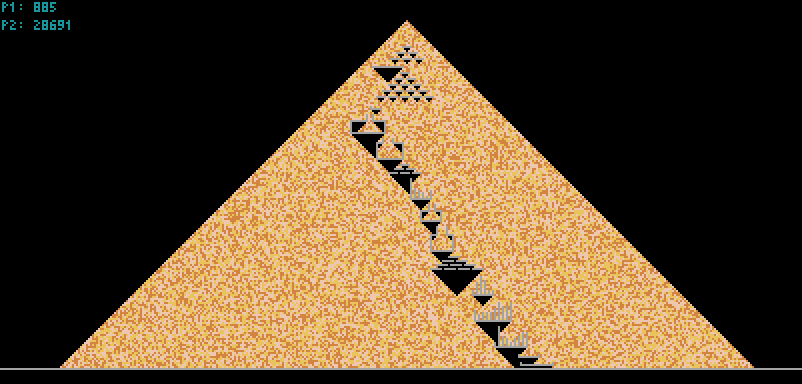

# Day 14 Visualizations

## Configuration

To enable/disable the animations, change the value of `OFFSCREEN_RENDER`. Animations will be enabled if `OFFSCREEN_RENDER` is `False`. Otherwise, the answer will be computed more quickly offscreen and the visualization will updated after both answers are found.
